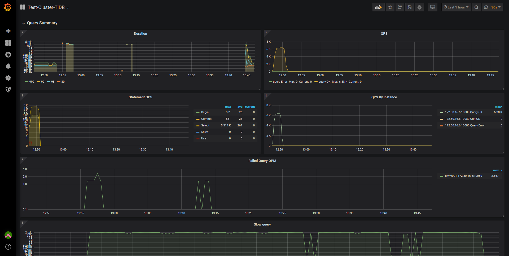
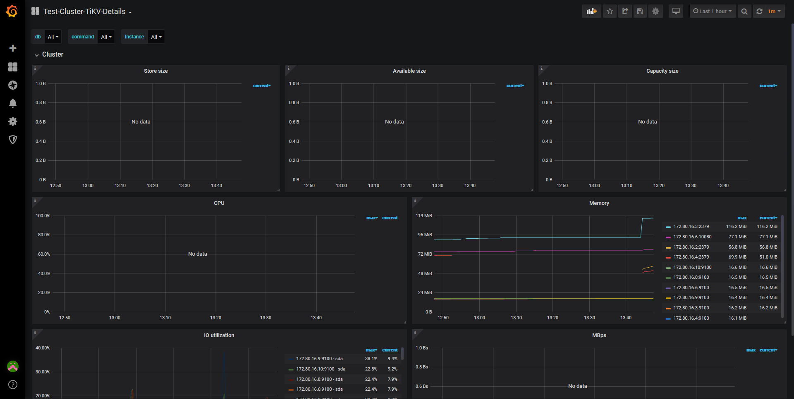
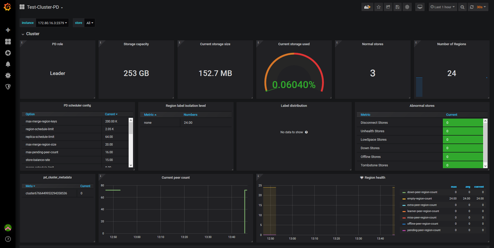
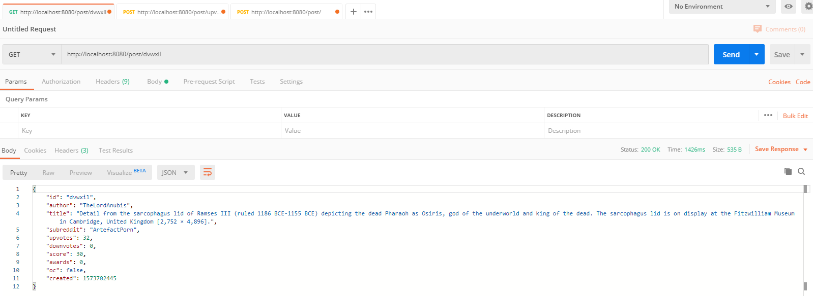
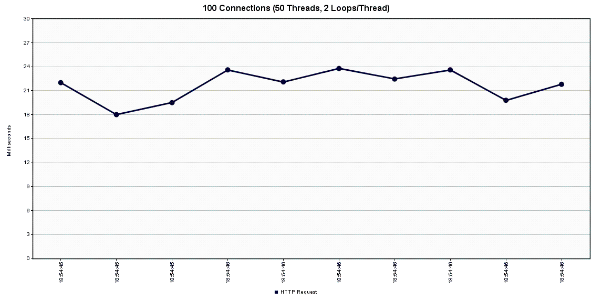
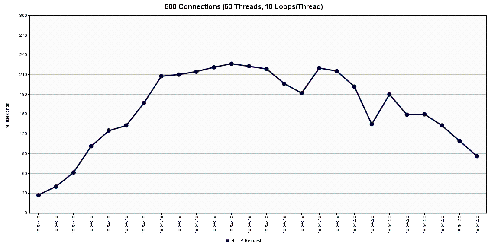
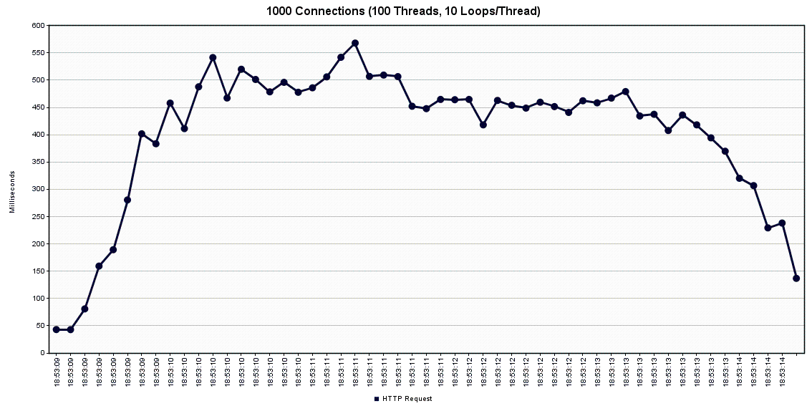
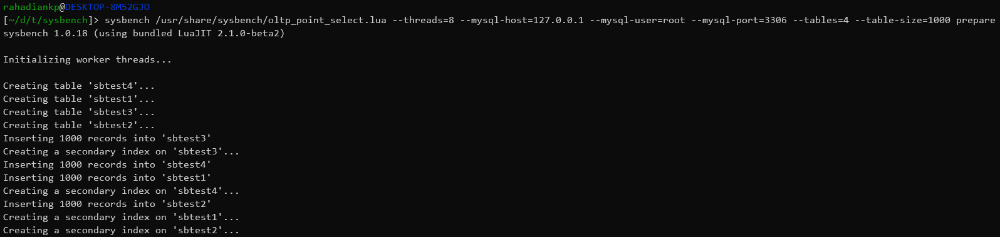
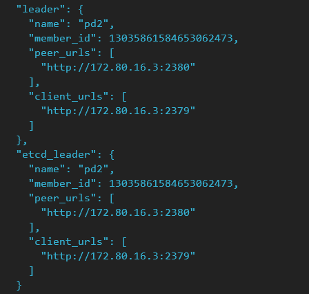
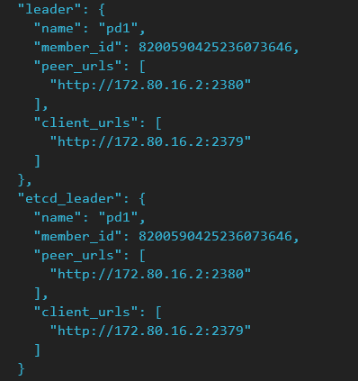

## Architecture


## How-To Start Containers
1. Build necessary images
```powershell
docker build .\img\ -f .\img\Dockerfile_pd -t bdt19/pd
docker build .\img\ -f .\img\Dockerfile_tidb -t bdt19/tidb
docker build .\img\ -f .\img\Dockerfile_tikv -t bdt19/tikv
docker build .\img\ -f .\img\Dockerfile_prometheus -t bdt19/prometheus
```
2. Deploy Placement Driver (`pd`) containers
```powershell
docker-compose up -d pd1 pd2 pd3
```
3. Deploy TiKV containers
```powershell
docker-compose up -d tikv1 tikv2 tikv3
```
4. Deploy TiDB
```powershell
docker-compose up -d tidb
```
5. Run `node_exporter` on each node by executing:
```powershell
.\run_node_exporter.ps1
```
6. Deploy Prometheus
```powershell
docker-compose up -d prometheus
```
7. Deploy Grafana
```powershell
docker-compose up -d grafana
```
8. Test environment is ready
## `docker-compose.yml` Brief Explanation
### Networking
```yaml
networks:
  tidbnet:
    driver: bridge
    ipam:
      config:
        - subnet: 172.80.16.0/28
```
IP Assignments:
- TiDB : `172.80.16.6`
- PD : `172.80.16.{2..4}`
- TiKV : `172.80.16.{8..10}`
- Prometheus : `172.80.16.12`
- Grafana : `172.80.16.14`
### TiDB
```yaml
services:
  ...
  tidb:
    image: bdt19/tidb:latest
    container_name: tidb
    hostname: tidb
    command:
      " --store=tikv
        --path=172.80.16.2:2379,172.80.16.3:2379,172.80.16.4:2379
      "
    ports:
      - 3306:4000
      - 10080:10080
    networks:
      tidbnet:
        ipv4_address: 172.80.16.6
  ...
```
Port `3306` is forwarded to port `4000`, easier application configuration. Port `10080` is exposed for test purpose only.  
Parameter `--path` is pointing to deployed Placement Driver containers, and the storing type is `tikv`.
### TiKV
```yaml
services:
  ...
  tikv1:
    image: bdt19/tikv:latest
    container_name: tikv1
    hostname: tikv1
    command:
      " --addr=0.0.0.0:20160
        --advertise-addr=172.80.16.8:20160
        --pd=172.80.16.2:2379,172.80.16.3:2379,172.80.16.4:2379
      "
    ports:
      - 20160:20160
    networks:
      tidbnet:
        ipv4_address: 172.80.16.8
  ...
```
TiKV server is configured for its address and advertise address; and parameter that points to available Placement Drivers.
### Placement Driver
```yaml
services:
  pd1:
    image: bdt19/pd:latest
    container_name: pd1
    hostname: pd1
    command:
      " --name=pd1
        --client-urls=http://0.0.0.0:2379
        --peer-urls=http://0.0.0.0:2380
        --advertise-client-urls=http://172.80.16.2:2379
        --advertise-peer-urls=http://172.80.16.2:2380 
        --initial-cluster=pd1=http://172.80.16.2:2380,pd2=http://172.80.16.3:2380,pd3=http://172.80.16.4:2380
      "
    ports:
      - 9100:9100
      - 2379:2379
    networks:
      tidbnet:
        ipv4_address: 172.80.16.2
  ...
```
PD requires peer and client urls, the former is for communication inter-PD and the latter is for client that wants to connect to PD. And initial available PDs.
### Prometheus
```yaml
services:
  ...
  prometheus:
    image: bdt19/prometheus:latest
    container_name: prometheus
    hostname: prometheus
    networks:
      tidbnet:
        ipv4_address: 172.80.16.12
  ...
```
No further configuration for Prometheus, aside from Prometheus startup configuration [`prometheus.yml`](img/prometheus.yml)
### Grafana
```yaml
services:
  ...
  grafana:
    image: grafana/grafana:latest
    container_name: grafana
    hostname: grafana
    environment:
      - GF_SERVER_HTTP_PORT=3000
      - GF_SERVER_DOMAIN=172.80.16.14
      - GF_ANALYTICS_CHECK_FOR_UPDATES=true
      - GF_SECURITY_ADMIN_USER=receh
      - GF_SECURITY_ADMIN_PASSWORD=receh
      - GF_LOG_MODE=file
      - GF_LOG_FILE_LEVEL=info
      - GF_LOG_FILE_FORMAT=text
      - GF_DASHBOARDS_JSON_ENABLED=false
      - GF_DASHBOARDS_JSON_PATH=./data/dashboards
      - GF_GRAFANA_NET=https://grafana.net
    ports:
      - 3000:3000
    networks:
      tidbnet:
        ipv4_address: 172.80.16.14
  ...
```
Grafana configuration can be configured by defining container enviroments like above. It is all related to Grafana website deployment and logging.
### Nodes Monitoring
After all TiDB services, Prometheus, and Grafana are up, visit `localhost:3000` to access Grafana. Follow steps on this [page](https://pingcap.com/docs/stable/how-to/monitor/monitor-a-cluster/#deploy-prometheus-and-grafana) to configure TiDB monitoring in Grafana. Below are the screentshots.
#### TiDB Monitor

#### TiKV Monitor

#### PD Monitor

### Performance Test
#### Application Test
RAPPer (Reddit API Post Processor) is a REST API application developed using Java 8 and Spring Framework. This app provides basic CRUD operation on Reddit Post. Dataset used by this app is identical with dataset used in [previous assignment](https://github.com/rahadiankp/bdt19/blob/master/mongo-sharding/posts_new.json), only small portion of data is used for the test.

Graphs below are generated by JMeter. JMeter is used to test this app's performance.



#### TiDB Test
Using [Sysbench](https://github.com/akopytov/sysbench) to test TiDB performance. The testname used for this test is `oltp_point_select`. Number of Placement Drivers will act as control variable. Test will be conducted 3 times, with 1 PD, 2 PDs, and 3 PDs.  
  
**NOTE**: As Sysbench is not supported natively in Windows, I had to execute the tests on Windows Subsystem Linux environment. Additional overheads are expected and may impact the test result.  
  
First, prepare the test environment on DB side. Execute this:
```bash
sysbench /usr/share/sysbench/oltp_point_select.lua --threads=8 --mysql-host=127.0.0.1 --mysql-user=root --mysql-port=3306 --tables=4 --table-size=1000 prepare
```

Next, execute line below to run the test:
```bash
sysbench /usr/share/sysbench/oltp_point_select.lua --threads=8 --mysql-host=127.0.0.1 --mysql-user=root --mysql-port=3306 --tables=4 --table-size=1000 run
```
##### Test Result with 1 Placement Driver
```
SQL statistics:
    queries performed:
        read:                            31968
        write:                           0
        other:                           0
        total:                           31968
    transactions:                        31968  (3194.89 per sec.)
    queries:                             31968  (3194.89 per sec.)
    ignored errors:                      0      (0.00 per sec.)
    reconnects:                          0      (0.00 per sec.)

General statistics:
    total time:                          10.0039s
    total number of events:              31968

Latency (ms):
         min:                                    0.88
         avg:                                    2.50
         max:                                   30.44
         95th percentile:                        4.82
         sum:                                79821.47

Threads fairness:
    events (avg/stddev):           3996.0000/24.38
    execution time (avg/stddev):   9.9777/0.00
```
##### Test Result with 2 Placement Drivers
```
SQL statistics:
    queries performed:
        read:                            31736
        write:                           0
        other:                           0
        total:                           31736
    transactions:                        31736  (3171.10 per sec.)
    queries:                             31736  (3171.10 per sec.)
    ignored errors:                      0      (0.00 per sec.)
    reconnects:                          0      (0.00 per sec.)

General statistics:
    total time:                          10.0057s
    total number of events:              31736

Latency (ms):
         min:                                    0.95
         avg:                                    2.52
         max:                                   26.29
         95th percentile:                        4.82
         sum:                                79819.31

Threads fairness:
    events (avg/stddev):           3967.0000/25.20
    execution time (avg/stddev):   9.9774/0.00
```
##### Test Result with 3 Placement Drivers
```
SQL statistics:
    queries performed:
        read:                            32222
        write:                           0
        other:                           0
        total:                           32222
    transactions:                        32222  (3219.82 per sec.)
    queries:                             32222  (3219.82 per sec.)
    ignored errors:                      0      (0.00 per sec.)
    reconnects:                          0      (0.00 per sec.)

General statistics:
    total time:                          10.0053s
    total number of events:              32222

Latency (ms):
         min:                                    0.91
         avg:                                    2.48
         max:                                   39.03
         95th percentile:                        4.57
         sum:                                79822.60

Threads fairness:
    events (avg/stddev):           4027.7500/20.91
    execution time (avg/stddev):   9.9778/0.00

```
##### Test Conclusion
The result is rather inconclusive. There is barely significant difference on the number of executed queries per second.
### Failover Simulation (Change of PD leader)
First, we check who is the current leader by executing:
```powershell
curl http://127.0.0.1:2379/pd/api/v1/members
```
**NOTE**: We utilize `pd1` exposed port 2379  
  
Stop the leader node `pd2`
```powershell
docker-compose stop pd2
```
Wait for a moment, let the rest of deployed PDs do the communication to elect new leader. Then once again, execute:
```powershell
curl http://127.0.0.1:2379/pd/api/v1/members
```
  
And now, `pd1` is the new leader of PDs.
