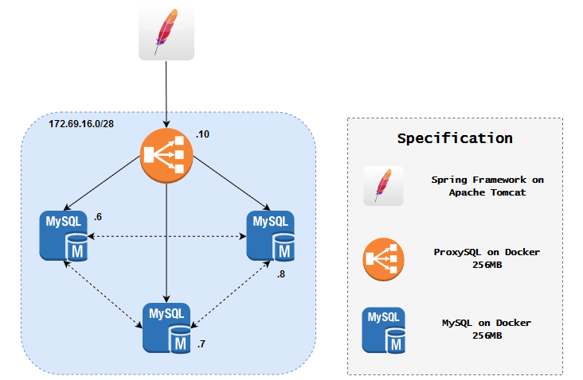

# BDT 2019 - ETS  
## Rancang Bangun Infrastruktur dan Spesifikasi  
  
Change log:  
- 00:44 09/10/2019:- Resize ProxySQL and MySQL memory limit to **256MB**  
- Change ProxySQL IP and **Apache** to **Apache Tomcat**  
## Implementasi  
### Konfigurasi MySQL dan ProxySQL  

### Aplikasi yang Digunakan
Aplikasi yang saya gunakan untuk menguji basis data terdistribusi ini adalah aplikasi berbasis Spring Framework yang kelompok kami kerjakan, dapat diakses [di sini](https://github.com/shunpeicloser/FP-PBKK-Payment). Aplikasi REST API ini digunakan untuk melayani pembayaran di dalam suatu sistem yang mirip dengan GrabFood atau GoFood.  
Aplikasi ini awalnya menggunakan basis data non-relasional, **MongoDB**. Beberapa adjustment harus dilakukan.
#### Dependensi yang Dibutuhkan
```
mysql:mysql-connector-java
org.springframework.boot:spring-boot-starter-data-jpa
org.springframework.boot:spring-boot-starter-web
```
#### Konfigurasi Aplikasi
application.properties:
```
server.port=8090  
  
spring.datasource.url=jdbc:mysql://localhost:3306/ojack_wallet?useSSL=false  
spring.datasource.username=ojack  
spring.datasource.password=w4ll3t  
  
spring.jpa.properties.hibernate.dialect = org.hibernate.dialect.MySQL5InnoDBDialect  
  
spring.jpa.hibernate.ddl-auto = update
```
