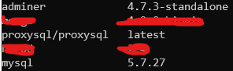
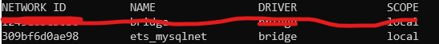

# BDT 2019 - ETS  
## Rancang Bangun Infrastruktur dan Spesifikasi  
  
Change log:  
- 00:44 09/10/2019:- Resize ProxySQL and MySQL memory limit to **256MB**  
- Change ProxySQL IP and **Apache** to **Apache Tomcat**  
## Implementasi  
Untuk menjalankan dan menguji tugas ETS basis data ini, digunakan **Docker** untuk menjalankan kontainer yang dibutuhkan. Apabila menggunakan [Chocolatey](https://chocolatey.org/), eksekusi perintah di bawah ini untuk menginstall Docker:
```
choco install docker-desktop
```
### Konfigurasi MySQL dan ProxySQL  

#### Docker Image
Untuk pull image yang digunakan untuk tugas ini, eksekusi perintah berikut:
```
docker pull mysql:5.7.27
docker pull proxysql/proxysql
docker pull adminer:4.7.3-standalone (OPTIONAL)
```
Setelah proses unduh selesai, cek dengan cara mengeksekusi perintah:
```
docker images
```


**Adminer** sepadan dengan phpMyAdmin. Tidak wajib digunakan, namun sangat mempermudah di tugas ini.

#### Docker Network
Membuat subnet khusus kontainer yang akan di-*deploy*. Di ilustrasi arsitektur di atas, digunakan subnet **172.69.16.0/28**. Sedangkan *driver* yang akan digunakan oleh Docker adalah `bridge`. Untuk menyiapkan jaringan tersebut, eksekusi perintah berikut:
```
docker network create -d brigde --subnet 172.69.16.0/28 ets_mysqlnet
```
Cek apakah subnet sudah *up*, dengan:
```
docker network ls
```
  
Selain menggunakan perintah `docker network create`, bisa juga menggunakan `docker-compose.yml`  untuk menyiapkan jaringan yang dibutuhkan.  
docker-compose.yml:
```
...
networks:
  mysqlnet:
    driver: bridge
    ipam:
      config:
        - subnet: 172.69.16.0/28
```
#### Dockerfile
##### Dockerfile untuk MySQL Server
Image yang digunakan untuk kontainer MySQL adalah `mysql`, dan tiap server MySQL membutuhkan file konfigurasi yang berbeda yang bisa dicek [di sini](https://github.com/rahadiankp/bdt19/tree/master/ets/db/mysql_cnf).
Dockerfile_**db1**:
```
FROM mysql:5.7.27

ENV MYSQL_ROOT_PASSWORD root

CMD ["--default-authentication-plugin=mysql_native_password"]

COPY mysql_cnf/db1.cnf /etc/mysql/my.cnf
COPY README.md /
COPY sqlfile/* /
```
Buat file yang serupa untuk Dockerfile_**db2** dan Dockerfile_**db3**.
Sedang untuk file docker-compose.yml:
```
services:
  ...
  db1:
    container_name: db1
    hostname: db1
    build:
      context: db
      dockerfile: Dockerfile_db1
    networks:
      mysqlnet:
        ipv4_address: 172.69.16.6
    mem_limit: 256m
```
Begitu juga untuk **db2** dan **db3**

##### Dockerfile untuk ProxySQL
Image yang digunakan untuk kontainer ProxySQL adalah `proxysql/proxysql`, dan file konfigurasi yang dibutuhkan oleh ProxySQL dapat dilihat [di sini](https://github.com/rahadiankp/bdt19/blob/master/ets/proxy/proxysql.cnf)
Setelah itu buat Dockerfile baru untuk menyalin file config tadi ke dalam image yang nanti akan digunakan.  
Dockerfile:
```
FROM proxysql/proxysql:latest

COPY proxysql.cnf /etc/proxysql.cnf
```
ProxySQL akan di-*deploy* di IP **172.69.16.10**. Port **3306** di mesin lokal harus terhubung ke port **6033** di mesin virtual ProxySQL. Sehingga update docker-compose.yml menjadi:
```
services:
  ...
  proxysql:
    container_name: proxysql
    hostname: proxysql
    build:
      context: proxy
      dockerfile: Dockerfile
    networks:
      mysqlnet:
        ipv4_address: 172.69.16.10
    ports:
      - 3306:6033
    mem_limit: 256m
```
##### Konfigurasi Adminer
Adminer akan di-*deploy* di IP **172.69.16.9**, dan port **8080** akan diekspose ke mesin lokal. Adminer tidak perlu hal khusus, oleh karena itu bisa langsung dimasukkan di docker-compose.yml:
```
services:
  ...
  adminer:
    container_name: adminer
    image: adminer:4.7.3-standalone
    ports:
     - 8080:8080
    networks:
      mysqlnet:
        ipv4_address: 172.69.16.9
    mem_limit: 64m
```
### Aplikasi yang Digunakan
Aplikasi yang saya gunakan untuk menguji basis data terdistribusi ini adalah aplikasi berbasis Spring Framework yang kelompok kami kerjakan, dapat diakses [di sini](https://github.com/shunpeicloser/FP-PBKK-Payment). Aplikasi REST API ini digunakan untuk melayani pembayaran di dalam suatu sistem yang mirip dengan GrabFood atau GoFood.  
Aplikasi ini awalnya menggunakan basis data non-relasional, **MongoDB**. Beberapa adjustment harus dilakukan.
#### Dependensi yang Dibutuhkan
```
mysql:mysql-connector-java
org.springframework.boot:spring-boot-starter-data-jpa
org.springframework.boot:spring-boot-starter-web
```
#### Konfigurasi Aplikasi
application.properties:
```
server.port=8090  
  
spring.datasource.url=jdbc:mysql://localhost:3306/ojack_wallet?useSSL=false  
spring.datasource.username=ojack  
spring.datasource.password=w4ll3t  
  
spring.jpa.properties.hibernate.dialect = org.hibernate.dialect.MySQL5InnoDBDialect  
  
spring.jpa.hibernate.ddl-auto = update
```

### Run
1. Build `docker-compose`. Hanya eksekusi saat pertama kali, atau saat ada perubahan di `Dockerfile`
    ```
    docker-compose build
    ```
2. Deploy semua kontainer
    ```
    docker-compose up
    ```
3. Konfigurasi setiap MySQL server dengan cara menjalankan `bash`, contohnya di `db1`
    ```
    docker-compose exec db1 bash
    ```
    Untuk lebih jelas, dapat dibaca [di file ini](https://github.com/rahadiankp/bdt19/blob/master/ets/db/README.md)
4. Run aplikasi
