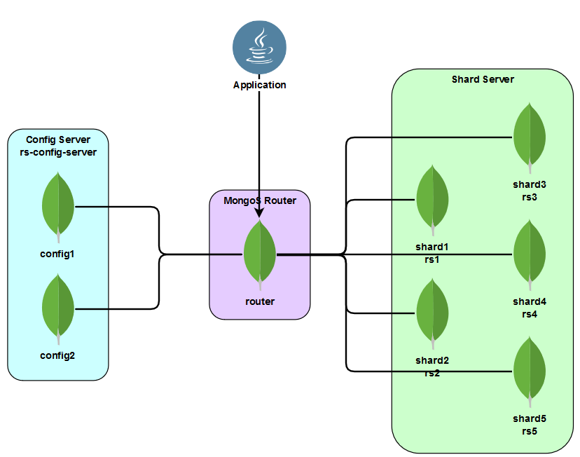

## Architecture

## About Dataset
- Dataset Description: Bunch of Reddit Posts collected from several subreddits (~2400 subreddits). Each data details post's title, author, upvotes count, downvotes count, awards count, subreddit
- Source: Personal, scrapped directly from Reddit, with minor post-processing (stripping unnecesary fields)
- Data Count: 64228 rows
## How-To Start Containers
1. Build image `bdt19/mongo:4.2.1`. The image will contain necessary scripts to run the containers
```
docker build .\container -t bdt19/mongo:4.2.1
```
2. Start the container using `docker-compose`
```
docker-compose up -d
```
3. After the containers are successfully deployed, execute `provision.ps1`
```
.\provision.ps1
```
**NOTE**: The `provision.ps1` script provisions MongoD config servers, MongoD shard servers, MongoS router, sharding cluster configuration, creating necessary database and collection, and data importing

4. Provisioning may take several seconds if not minutes, please wait. After successfully provisioned, MongoDB Shard Clustering is ready for application use
## `docker-compose.yml` Brief Explanation
### Networking
```yml
networks:
  clusternet:
    driver: bridge
    ipam:
      config:
        - subnet: 172.69.42.0/28
```
Each container will be given IP in subnet `172.69.42.0/28`. IPs assignment:
  - `router` &rarr; `172.69.42.2`
  - `config1` &rarr; `172.69.42.3`
  - `config2` &rarr; `172.69.42.4`
  - `shard1` &rarr; `172.69.42.5`
  - `shard2` &rarr; `172.69.42.6`
  - `shard3` &rarr; `172.69.42.7`
  - `shard4` &rarr; `172.69.42.8`
  - `shard5` &rarr; `172.69.42.9`

### Mongo Start-up
1. MongoS Router
    ```yaml
    router:
      ...
      command: mongos --configdb rs-config-server/config1:27019,config2:27019 --bind_ip_all
      ports:
        - 27017:27017
      ...
    ```
    `mongos` is used as router as `mongos` will route query to shard cluster. Option `--configdb` is to define config server replica set and its members for `mongos` to use. As for `--bind_ip_all` is to ensure that `mongos` will be accesible through all available interfaces. Finally, exposing port `27017` to local machine is mandatory, as the application will connect to `mongos` through this port.
  
2. Config Server
   ```yaml
   config1:
     ...
     command: mongod --configsvr --replSet rs-config-server
     ...
   ```
   Option `--configsvr` will start Mongo Daemon with config server role. Since config server should be a replica set, it is a must to define the name of the replica set using option `--replSet`

3. Shard Server
   ```yaml
   shard1:
     ...
     command: mongod --shardsvr --replSet rs1
     ...
   ```
   Option `--shardsvr` will start Mongo Daemon with shard server role. Since shard server should be a replica set, it is a must to define the name of the replica set using option `--replSet`. **NOTE**: it is all fine to define a replica set with one member only
## Application
Reddit Post Processor (RPP) is console application to process saved Reddit Posts in MongoDB database. RPP is written in Java and uses [`mongo-java-driver`](http://mongodb.github.io/mongo-java-driver/) to connect to MongoDB server.  
### Application Features
1. Create, Read, and Delete Reddit Post
2. Update Reddit Post's title
3. Find top 5 subreddits which earn the most upvotes and avg. per post
4. Find top 5 authors which earn the most upvotes and awards
