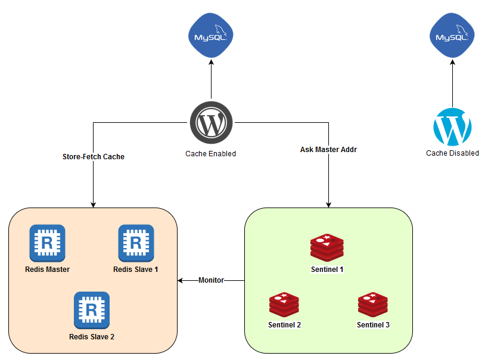
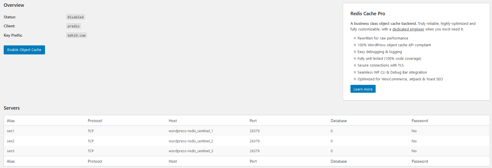
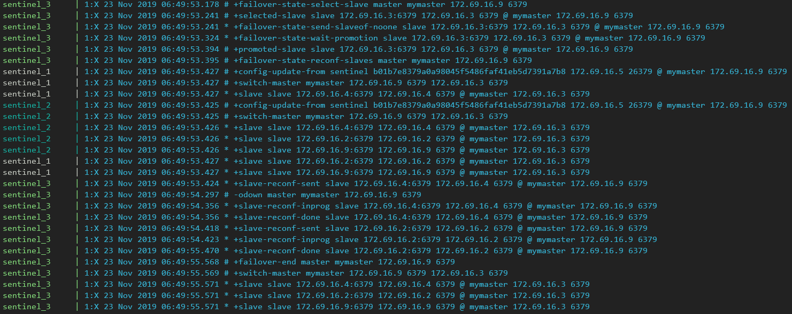
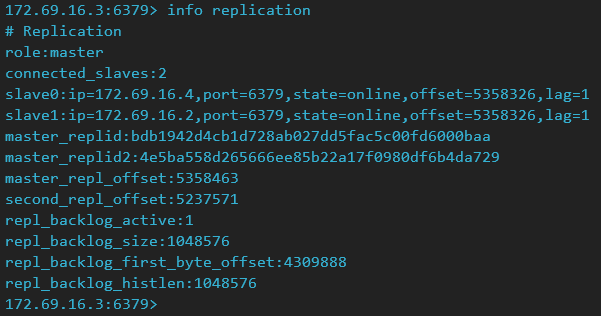

## Architecture

### Network and IP Assignments
Subnet: `172.69.16.0/27`
- Wordpress (Redis cache enabled): `172.69.16.6`
- Wordpress (No cache): `172.69.16.7`
- MySQL Database: `172.69.16.8`
- Redis Master: `172.69.16.9`
- Redis Slaves: any unassigned IPs
- Sentinels: any unassigned IPs
## How-To Start Containers
1. Deploy `db` container first. Wordpress depends on MySQL instance 
```powershell
docker-compose up -d db
```
**NOTE**: Check if MySQL service is already up by executing `docker-compose logs db`

2. After MySQL is up, create new database for Wordpress without cache. Database for Wordpress with cache is automatically created
```powershell
.\create_db_web_nocache.ps1
```
3. Deploy 2 Wordpress instances, `web` and `web_nocache`
```powershell
docker-compose up -d web web_nocache
```
4. Deploy Redis Master
```powershell
docker-compose up -d master
```
5. Deploy 2 Redis Slaves and 3 Redis Sentinel by using `--scale` options
```powershell
docker-compose up -d --no-deps --scale sentinel=3 --scale slave=2 sentinel slave
```
6. Test environment is ready.
## Wordpress Redis Cache
Using Wordpress plugin Redis Cache Object ([redis-cache](https://wordpress.org/plugins/redis-cache/)), Wordpress can store cache into Redis instance. Install this plugin only on Wordpress with cache enabled container.  
To install, simply go to *Plugins* > *Add New* > *Search for `redis`* > *Install* > *Activate*.  
Edit `wp-config.php`, and add lines below to the file:
```php
define('WP_CACHE_KEY_SALT', 'bdt19.com');
define('WP_CACHE', true);
define('WP_REDIS_SENTINEL', 'mymaster');
define('WP_REDIS_CLIENT', 'predis');
define('WP_REDIS_SERVERS', ['tcp://wordpress-redis_sentinel_1:26379/?alias=sen1', 'tcp://wordpress-redis_sentinel_2:26379/?alias=sen2', 'tcp://wordpress-redis_sentinel_3:26379/?alias=sen3']);
```
There is `predis` bug where Redis Replication using Sentinel always encounters an error. To fix the bug, simply execute:
```powershell
.\fix_predis.ps1
```
Go to *Settings* > *Redis*, and you will see screen like below

Now Redis Object Cache is ready to cache Wordpress stuffs
## Sentinel Failover Simulation
In this simulation, a Redis replication group consists of 1 Redis master and 3 Redis slaves. Each slave is assigned to `172.169.16.2`, `172.69.16.3`, `172.69.16.4`. First, stop `master` container.
```powershell
docker-compose stop master
```
Check Redis Sentinels' logs by executing:
```powershell
docker-compose logs sentinel
```

Sentinel_2 and Sentinel_3 detect that `172.69.16.9` (`master`) is down, and both Sentinel have reached the quorum that declares `master` is down. Sentinel_3 then elected to be the leader of available Sentinels.  

Sentinel_3, elected as the leader, now initiate failover and try to elect and promote new master. Sentinel_3 elects and promotes `172.69.16.3` (`slave2`) as the new master. Now `master` is considered as slave, whilst `slave2` is now acting as master.  
  
Check replication information in `slave2`. `slave2` is now confirmed as master of the replication group.
