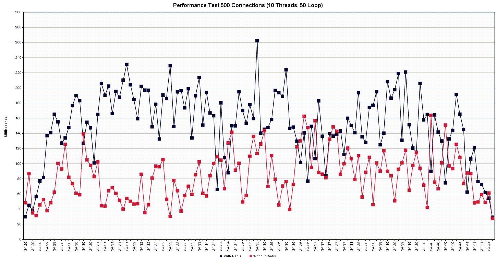
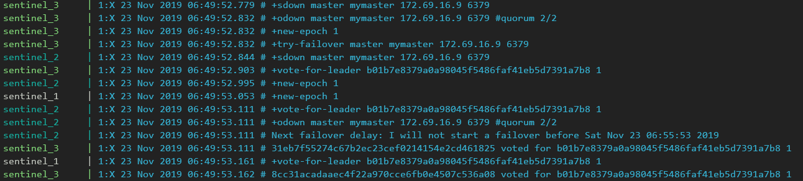

## Architecture


## How-To Start Containers
1. Deploy `db` and `db_nocache` container first. Wordpress depends on MySQL instance 
```powershell
docker-compose up -d db db_nocache
```
**NOTE**: Check if MySQL service is already up by executing `docker-compose logs db`

2. Deploy 2 Wordpress instances, `web` and `web_nocache`
```powershell
docker-compose up -d web web_nocache
```
3. Deploy Redis Master
```powershell
docker-compose up -d master
```
4. Deploy 2 Redis Slaves and 3 Redis Sentinel by using `--scale` options
```powershell
docker-compose up -d --no-deps --scale sentinel=3 --scale slave=2 sentinel slave
```
5. Test environment is ready.
## `docker-compose.yml` Brief Explanation
### Networking
```yaml
networks:
  wordpressnet:
    driver: bridge
    ipam:
      config:
        - subnet: 172.69.16.0/28
  nocachenet:
    driver: bridge
    ipam:
      config:
        - subnet: 172.70.16.0/29
```
2 distinct networks will be used to avoid congestion due to JMeter test
- Subnet `wordpressnet`: `172.69.16.0/28` (Wordpress with Redis)
  - Wordpress (Redis cache enabled): `172.69.16.6`
  - MySQL Database: `172.69.16.7`
  - Redis Master: `172.69.16.9`
  - Redis Slaves: any unassigned IPs
  - Sentinels: any unassigned IPs
- Subnet `nocachenet`: `172.70.16.0/29` (Wordpress without Redis)
  - Wordpress (No cache): any unassigned IPs
  - MySQL Database: any unassigned IPs
### Wordpress
```yaml
services:
  ...
  web:
    image: wordpress:5.3.0-apache
    container_name: web
    hostname: web
    environment:
      WORDPRESS_DB_HOST: db
      WORDPRESS_DB_USER: wordpress
      WORDPRESS_DB_PASSWORD: wordpress
      WORDPRESS_DB_NAME: wordpress
      WORDPRESS_TABLE_PREFIX: wp_
      WORDPRESS_CONFIG_EXTRA: |
        define('WP_CACHE_KEY_SALT', 'bdt19.com');
        define('WP_CACHE', true);
        define('WP_REDIS_SENTINEL', 'mymaster');
        define('WP_REDIS_CLIENT', 'predis');        
        define('WP_REDIS_SERVERS', ['tcp://wordpress-redis_sentinel_1:26379/?alias=sen1', 'tcp://wordpress-redis_sentinel_2:26379/?alias=sen2', 'tcp://wordpress-redis_sentinel_3:26379/?alias=sen3']);      
    ports:
      - 8069:80
    depends_on:
      - db
  ...
```
Configuration above is for Wordpress with Redis. `environment` is defined for MySQL connection and Redis cache configuration. Wordpress will be accessible from `localhost:8069`. This container also depends on `db` instance, since Wordpress needs to connect to MySQL.  
Similar configuration for Wordpress without Redis caching. The `environment` does not contain anything related to Redis.
### MySQL
```yaml
services:
  ...
  db:
    image: mysql:5.7.27
    container_name: db
    hostname: db
    environment:
      MYSQL_ROOT_PASSWORD: root
      MYSQL_DATABASE: wordpress
      MYSQL_USER: wordpress
      MYSQL_PASSWORD: wordpress
    networks:
      wordpressnet:
        ipv4_address: 172.69.16.7
  ...
```
Configuration above is for MySQL. This container is specifically used by Wordpress with Redis caching. Similar configuration also applied to MySQL for Wordpress without Redis caching, but attached to different network, `nocachenet`
### Redis
#### Redis Master
```yaml
services:
  ...
  master:
    image: bitnami/redis:latest
    container_name: redis-master
    hostname: redis-master
    environment:
      REDIS_REPLICATION_MODE: master
      ALLOW_EMPTY_PASSWORD: 'yes'
    networks:
      wordpressnet:
        ipv4_address: 172.69.16.9
  ...
```
#### Redis Slave
```yaml
services:
  ...
  slave:
    image: bitnami/redis:latest
    environment:
      REDIS_REPLICATION_MODE: slave
      REDIS_MASTER_HOST: redis-master
      ALLOW_EMPTY_PASSWORD: 'yes'
    depends_on:
      - master
      - web
    networks:
      - wordpressnet
  ...
```
#### Redis Sentinel
```yaml
services:
  ...
  sentinel:
    image: bitnami/redis-sentinel:latest
    environment:
      REDIS_MASTER_HOST: redis-master
    depends_on:
      - master
      - web
    networks:
      - wordpressnet
  ...
```
## Wordpress Redis Cache
Using Wordpress plugin Redis Cache Object ([redis-cache](https://wordpress.org/plugins/redis-cache/)), Wordpress can store cache into Redis instance. Install this plugin only on Wordpress with cache enabled container.  
To install, simply go to *Plugins* > *Add New* > *Search for `redis`* > *Install* > *Activate*.  
Go to *Settings* > *Redis*, and you will see screen like below

Now Redis Object Cache is ready to cache Wordpress stuffs
## Wordpress Redis Caching Performance
### Test Briefing
The following Wordpress post is used as performance test.

There will be 3 performance tests classified by numbers of connections:
- 100 Connections (10 Threads, 10 loops/thread)
- 250 Connections (10 Threads, 25 loops/thread)
- 500 Connections (10 Threads, 50 loops/thread)
### Test Result Graph
#### 100 Connections

#### 250 Connections

#### 500 Connections

### Test Conclusion
Based on the graphs above, weirdly enough, the load time required by Wordpress without Redis caching is faster than the one with Redis caching enabled. This is counter-intuitive, so what happened?  
Let's monitor any GET/SET operation in current Redis master, by executing:
```powershell
docker-compose exec master redis-cli monitor | Select-String -Pattern "(S|G)ET"
```
And this is what happened when a page is requested/loaded

Only one page is requested, but the plugin hits Redis so many times. Every response sent by Redis contains overhead payloads, this is the root cause. With so many hits required by loading a single page, the plugin must process tons of Redis overhead + main data. In this case, Redis loses; on the other hand, fetching directly from MySQL requires less overheads than Redis, therefore MySQL wins in this case
## Sentinel Failover Simulation
In this simulation, a Redis replication group consists of 1 Redis master and 3 Redis slaves. Each slave is assigned to `172.169.16.2`, `172.69.16.3`, `172.69.16.4`. First, stop `master` container.
```powershell
docker-compose stop master
```
Check Redis Sentinels' logs by executing:
```powershell
docker-compose logs sentinel
```

Sentinel_2 and Sentinel_3 detect that `172.69.16.9` (`master`) is down, and both Sentinel have reached the quorum that declares `master` is down. Sentinel_3 then elected to be the leader of available Sentinels.  

Sentinel_3, elected as the leader, now initiate failover and try to elect and promote new master. Sentinel_3 elects and promotes `172.69.16.3` (`slave2`) as the new master. Now `master` is considered as slave, whilst `slave2` is now acting as master.  
  
Check replication information in `slave2`. `slave2` is now confirmed as master of the replication group.
